# IMSAM AI Interview - Figma Mermaid 다이어그램

> Mermaid to Figma 플러그인용 코드 모음
> 문서 생성일: 2025년

---

## 1. 서비스 주요 기능 (우선순위별)

### 1-1. 기능 우선순위 맵
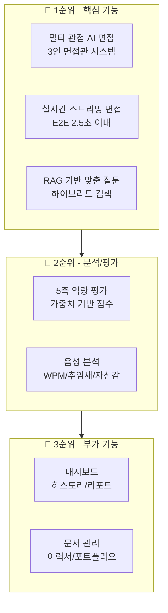

### 1-2. 3인 면접관 시스템
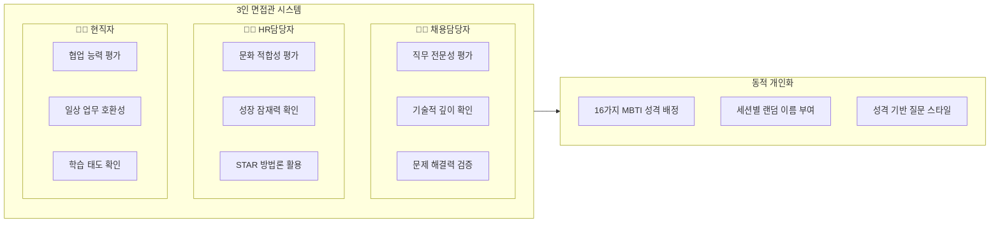

### 1-3. 실시간 스트리밍 파이프라인
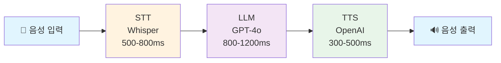

### 1-4. RAG 하이브리드 검색
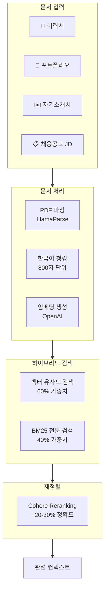

---

## 2. 사용자 흐름 (User Flow)

### 2-1. 메인 면접 플로우
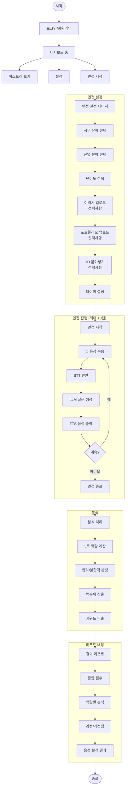

### 2-2. 인증 플로우
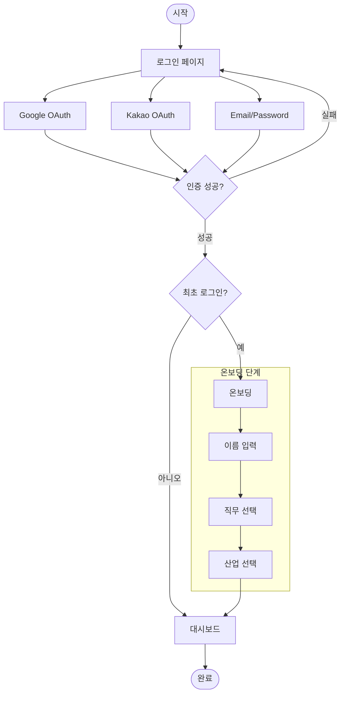

### 2-3. 면접 중 면접관 전환 로직
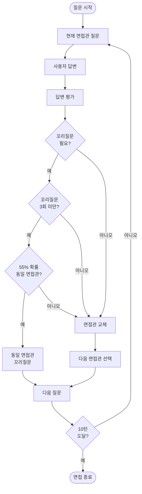

---

## 3. 서비스 아키텍처

### 3-1. 전체 시스템 아키텍처
```mermaid
flowchart TB
    subgraph Client["👤 클라이언트"]
        Web[Web Browser]
        iOS[iOS App]
        Android[Android App]
    end

    subgraph Frontend["Frontend Layer"]
        Next[Next.js 16<br/>App Router]
        React[React 18]
        Tailwind[Tailwind CSS]
        Radix[Radix UI]
        Zustand[Zustand State]
        SWR[SWR Fetching]
        Capacitor[Capacitor<br/>Mobile Bridge]
    end

    subgraph Backend["Backend Layer - Vercel"]
        subgraph APIs["API Routes"]
            Interview[/interview<br/>start, message, end, stream]
            RAG[/rag<br/>upload, evaluate]
            Auth[/auth<br/>logout, delete]
            STT[/stt<br/>Whisper]
            TTS[/tts<br/>OpenAI]
            Profile[/profile<br/>update]
        end
    end

    subgraph AI["AI/ML Services"]
        OpenAI[OpenAI APIs]
        subgraph OpenAIServices["OpenAI"]
            GPT4[GPT-4o<br/>LLM]
            Whisper[Whisper<br/>STT]
            TTSService[TTS-1<br/>TTS]
            Embed[text-embedding-3-small<br/>Embeddings]
        end
        Cohere[Cohere<br/>Reranking]
        LlamaParse[LlamaParse<br/>PDF Parsing]
    end

    subgraph Database["Database Layer"]
        Supabase[(Supabase)]
        subgraph SupabaseServices["Supabase Services"]
            Postgres[(PostgreSQL)]
            pgvector[pgvector<br/>Vector Search]
            SupaAuth[Supabase Auth<br/>Google, Kakao]
            RLS[Row Level Security]
        end
    end

    subgraph Infra["Infrastructure"]
        Vercel[Vercel<br/>Hosting]
        Sentry[Sentry<br/>Error Tracking]
        Clarity[Clarity<br/>Analytics]
    end

    Client --> Frontend
    Frontend --> Backend
    Backend --> AI
    Backend --> Database
    Backend --> Infra
```

### 3-2. 실시간 스트리밍 아키텍처
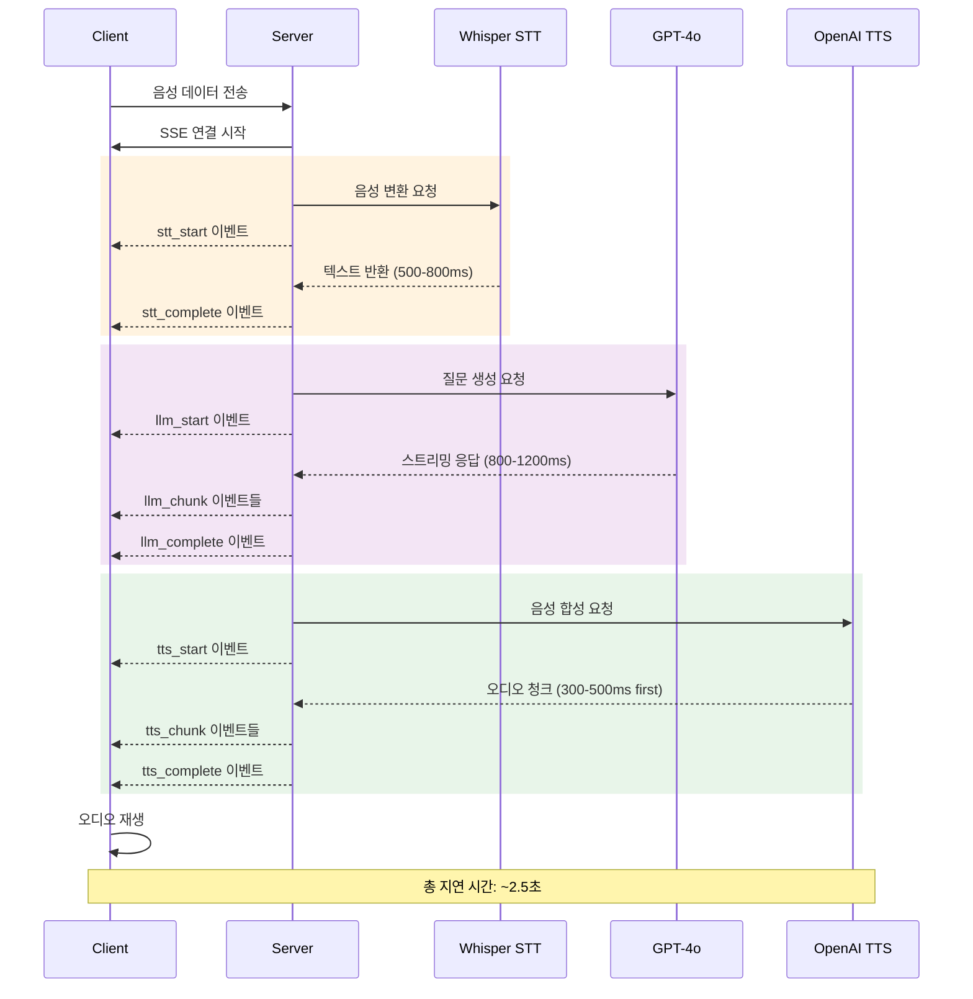

### 3-3. RAG 파이프라인 아키텍처
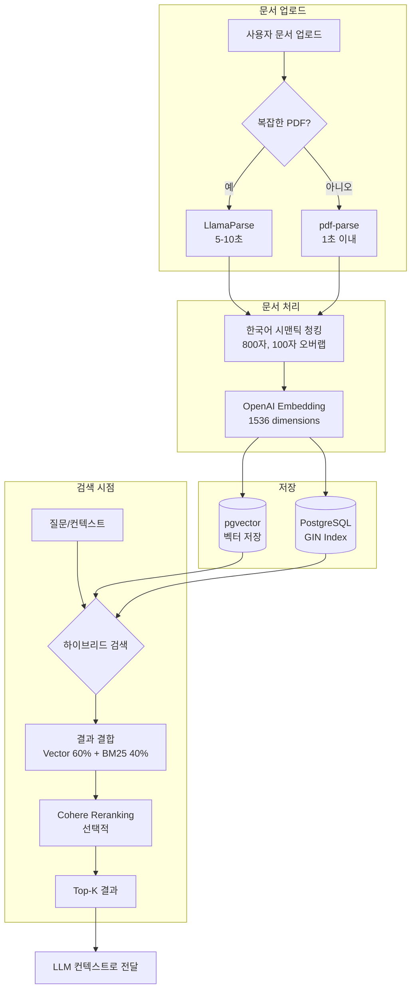

---

## 4. 데이터 모델 (ERD)

### 4-1. 전체 ERD
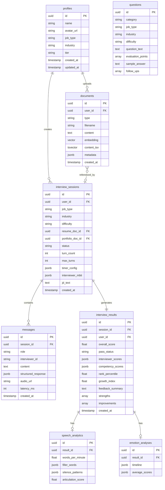

### 4-2. 핵심 테이블 관계
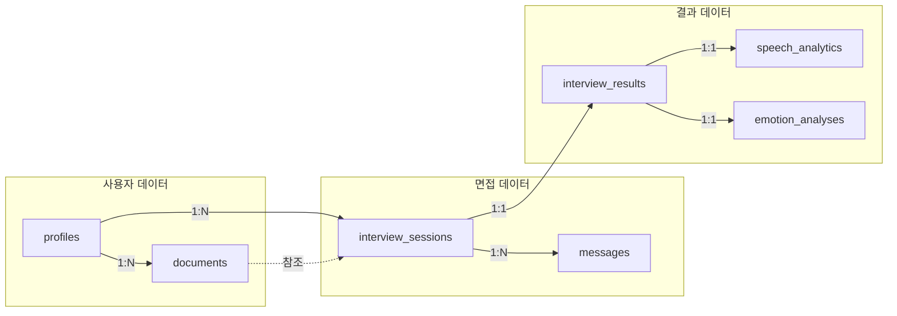

---

## 5. 데이터 흐름도

### 5-1. 전체 데이터 흐름
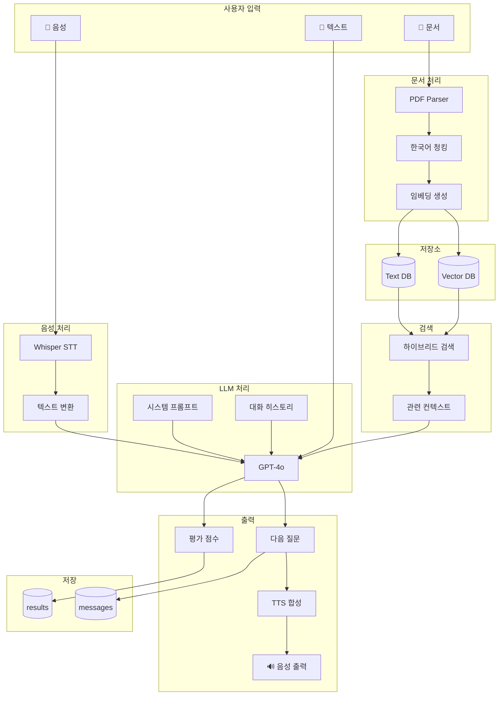

### 5-2. 면접 세션 데이터 흐름
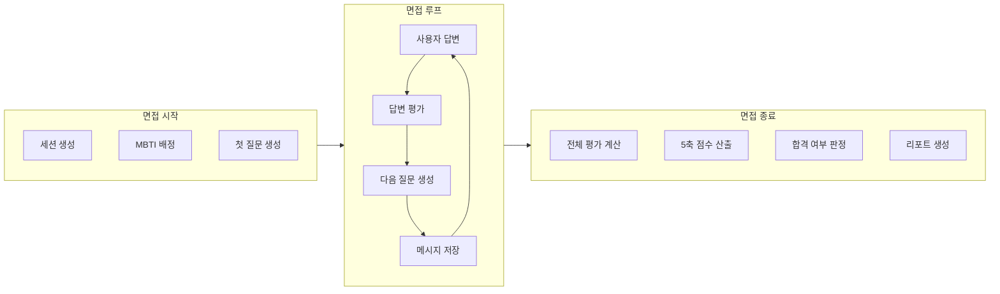

---

## 6. 시스템 프롬프트 구조

### 6-1. 프롬프트 구성 요소
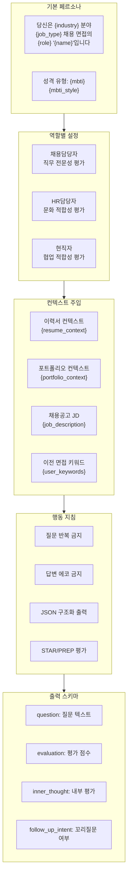

### 6-2. MBTI 성격 스타일 영향
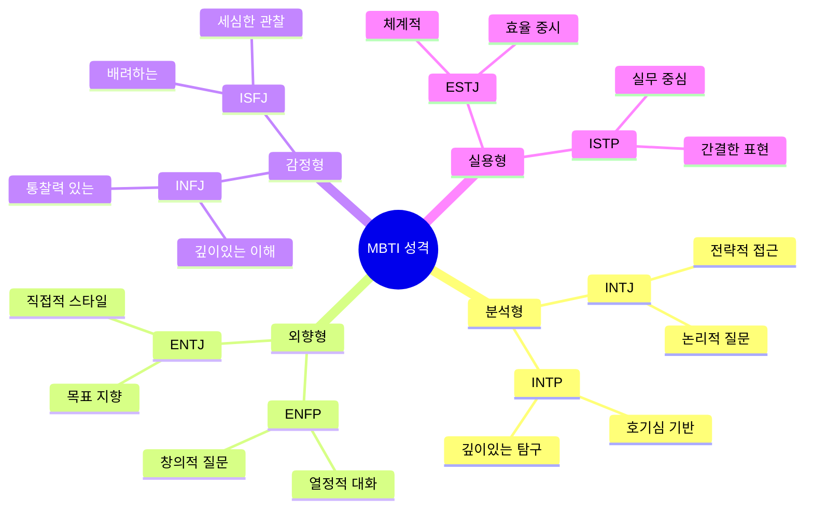

---

## 7. 5축 역량 평가 체계

### 7-1. 평가 카테고리
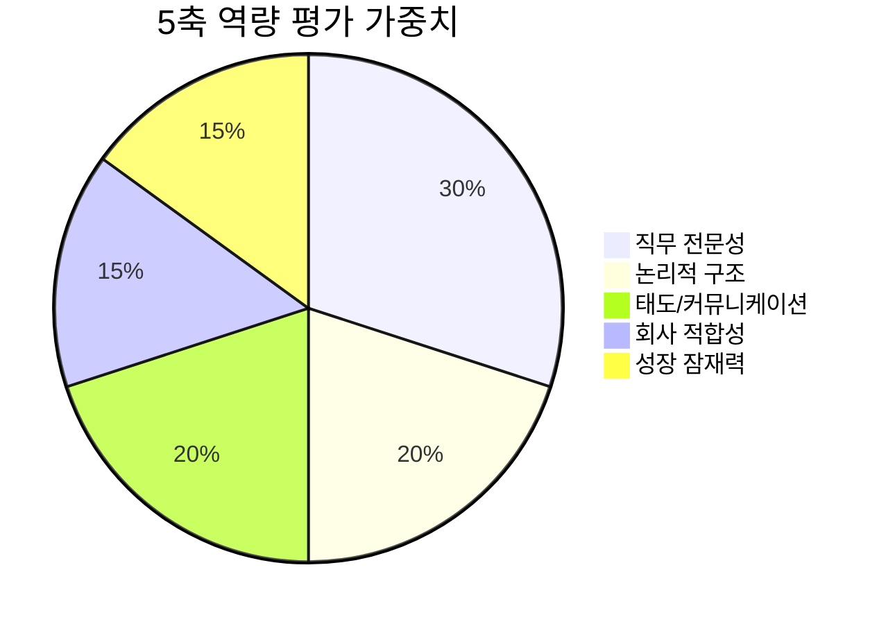

### 7-2. 평가 프로세스
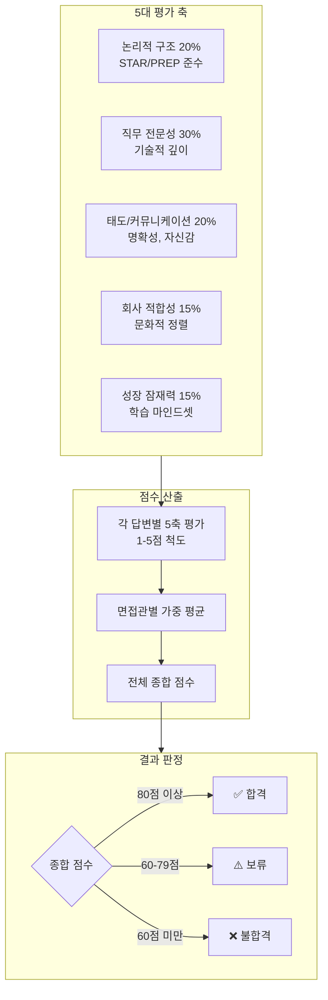

### 7-3. 5단계 평가 척도
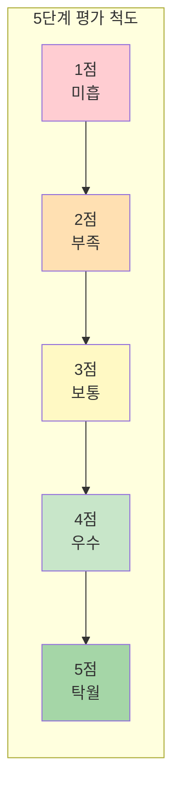

---

## 8. 기술 스택

### 8-1. 기술 스택 레이어
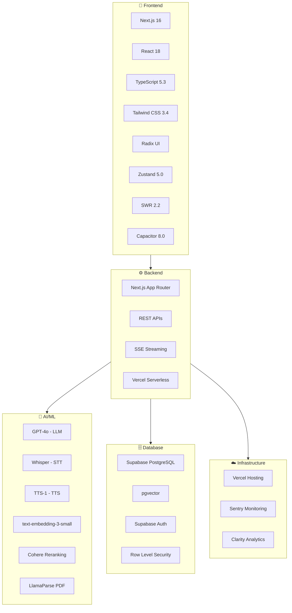

### 8-2. 인증 시스템
```mermaid
flowchart LR
    subgraph Providers["OAuth Providers"]
        G[Google]
        K[Kakao]
        E[Email/Password]
    end

    subgraph Auth["Supabase Auth"]
        JWT[JWT Token]
        Session[Session Management]
    end

    subgraph Security["보안"]
        RLS[Row Level Security]
        Encrypt[데이터 암호화]
    end

    Providers --> Auth --> Security
```

---

## 9. 성능 지표

### 9-1. 지연 시간 목표
```mermaid
gantt
    title 스트리밍 지연 시간 (ms)
    dateFormat X
    axisFormat %s

    section STT
    Whisper    :0, 800

    section LLM
    GPT-4o     :800, 2000

    section TTS
    First Chunk :2000, 2500

    section Total
    E2E Target :milestone, 2500, 0
```

### 9-2. RAG 성능
```mermaid
xychart-beta
    title "RAG 검색 성능 비교"
    x-axis ["Vector Only", "Hybrid", "Hybrid+Rerank"]
    y-axis "응답시간 (ms)" 0 --> 700
    bar [175, 250, 500]
```

---

## 10. 보안 아키텍처

### 10-1. 보안 레이어
```mermaid
flowchart TB
    subgraph Client["클라이언트"]
        HTTPS[HTTPS Only]
    end

    subgraph API["API Layer"]
        RateLimit[Rate Limiting<br/>20 req/60s]
        Validation[Input Validation]
        XSS[XSS Protection]
    end

    subgraph Auth["인증"]
        JWT[JWT Tokens]
        OAuth[OAuth 2.0]
    end

    subgraph Data["데이터"]
        RLS[Row Level Security]
        Encrypt[필드 암호화]
    end

    subgraph Headers["보안 헤더"]
        H1[X-Frame-Options: DENY]
        H2[X-Content-Type-Options: nosniff]
        H3[X-XSS-Protection: 1]
    end

    Client --> API --> Auth --> Data
    API --> Headers
```

---

*문서 생성일: 2025년*
*프로젝트: IMSAM AI Interview Service*
*Production URL: https://interview.sday.me*
