# IMSAM AI Interview - PPT용 Figma 다이어그램

> PPT 슬라이드 비율(16:9)에 최적화된 가로형 다이어그램
> 문서 생성일: 2025년

---

## 🎨 브랜드 컬러

```
Mint:    #00D9A3    Navy:    #0A1628    Purple:  #6C63FF
Pink:    #FF6B9D    Blue:    #A8C5FF    Green:   #10B981
```

---

## 1. 서비스 기능 우선순위

```mermaid
%%{init: {'theme': 'base', 'themeVariables': { 'primaryColor': '#0A1628', 'primaryTextColor': '#fff', 'lineColor': '#00D9A3'}}}%%
flowchart LR
    subgraph P1["🥇 1순위"]
        A1(["🎭 멀티관점 AI면접"])
        A2(["⚡ 실시간 스트리밍"])
        A3(["🔍 RAG 맞춤질문"])
    end

    subgraph P2["🥈 2순위"]
        B1(["📊 5축 역량평가"])
        B2(["🎙️ 음성분석"])
    end

    subgraph P3["🥉 3순위"]
        C1(["📈 대시보드"])
        C2(["📁 문서관리"])
    end

    P1 ==> P2 ==> P3

    style P1 fill:#00D9A3,stroke:#00D9A3,color:#0A1628
    style P2 fill:#6C63FF,stroke:#6C63FF,color:#fff
    style P3 fill:#A8C5FF,stroke:#A8C5FF,color:#0A1628
    style A1 fill:#0A1628,stroke:#00D9A3,color:#fff
    style A2 fill:#0A1628,stroke:#00D9A3,color:#fff
    style A3 fill:#0A1628,stroke:#00D9A3,color:#fff
    style B1 fill:#1a2744,stroke:#6C63FF,color:#fff
    style B2 fill:#1a2744,stroke:#6C63FF,color:#fff
    style C1 fill:#f0f4ff,stroke:#A8C5FF,color:#0A1628
    style C2 fill:#f0f4ff,stroke:#A8C5FF,color:#0A1628
```

---

## 2. 3인 면접관 시스템

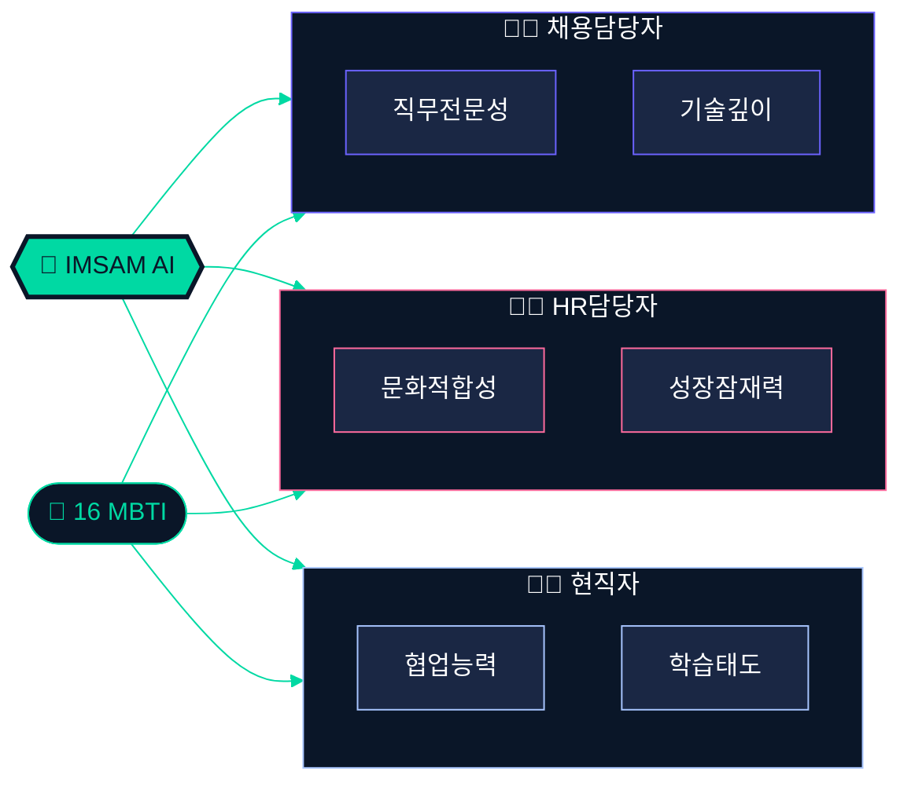

---

## 3. 실시간 스트리밍 파이프라인

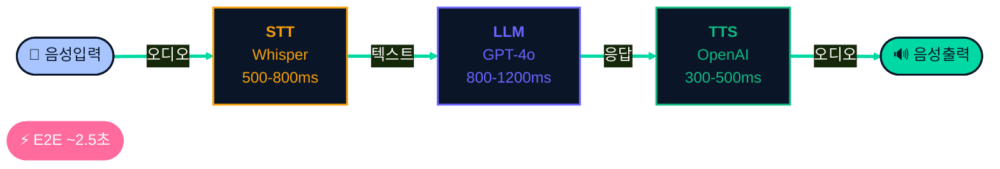

---

## 4. RAG 하이브리드 검색

```mermaid
%%{init: {'theme': 'base', 'themeVariables': { 'primaryColor': '#0A1628', 'primaryTextColor': '#fff', 'lineColor': '#00D9A3'}}}%%
flowchart LR
    subgraph DOCS["📄 문서"]
        D1(["이력서"])
        D2(["포트폴리오"])
        D3(["JD"])
    end

    subgraph PROC["⚙️ 처리"]
        P1["PDF파싱"]
        P2["청킹"]
        P3["임베딩"]
    end

    subgraph SEARCH["🔍 검색"]
        S1[("Vector 60%")]
        S2[("BM25 40%")]
    end

    R1{{"Rerank"}}
    O1(["✨ 컨텍스트"])

    DOCS --> PROC --> SEARCH --> R1 --> O1

    style DOCS fill:#A8C5FF,stroke:#A8C5FF,color:#0A1628
    style PROC fill:#0A1628,stroke:#6C63FF,color:#fff
    style SEARCH fill:#0A1628,stroke:#00D9A3,color:#fff
    style R1 fill:#6C63FF,stroke:#6C63FF,color:#fff
    style O1 fill:#00D9A3,stroke:#0A1628,color:#0A1628
    style D1 fill:#0A1628,stroke:#A8C5FF,color:#A8C5FF
    style D2 fill:#0A1628,stroke:#A8C5FF,color:#A8C5FF
    style D3 fill:#0A1628,stroke:#A8C5FF,color:#A8C5FF
    style S1 fill:#00D9A3,stroke:#0A1628,color:#0A1628
    style S2 fill:#A8C5FF,stroke:#0A1628,color:#0A1628
```

---

## 5. 사용자 플로우 (메인)

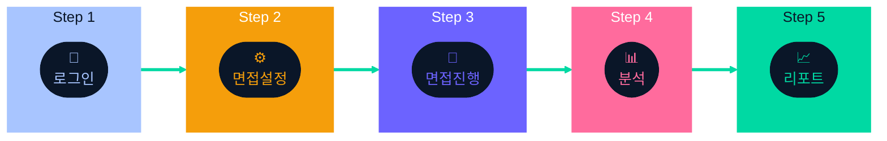

---

## 6. 면접 설정 상세

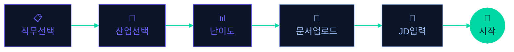

---

## 7. 면접 진행 루프

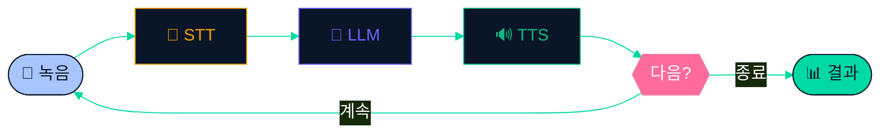

---

## 8. 시스템 아키텍처

```mermaid
%%{init: {'theme': 'base', 'themeVariables': { 'primaryColor': '#0A1628', 'primaryTextColor': '#fff', 'lineColor': '#00D9A3'}}}%%
flowchart LR
    subgraph CLIENT["👤 Client"]
        C1(["Web"])
        C2(["iOS"])
        C3(["Android"])
    end

    subgraph FRONT["🎨 Frontend"]
        F1["Next.js"]
        F2["React"]
    end

    subgraph BACK["⚙️ Backend"]
        B1["/interview"]
        B2["/rag"]
    end

    subgraph AI["🤖 AI"]
        A1["GPT-4o"]
        A2["Whisper"]
        A3["TTS"]
    end

    subgraph DB["🗄️ DB"]
        D1[("Supabase")]
    end

    CLIENT --> FRONT --> BACK --> AI --> DB

    style CLIENT fill:#A8C5FF,stroke:#A8C5FF,color:#0A1628
    style FRONT fill:#00D9A3,stroke:#00D9A3,color:#0A1628
    style BACK fill:#6C63FF,stroke:#6C63FF,color:#fff
    style AI fill:#FF6B9D,stroke:#FF6B9D,color:#fff
    style DB fill:#0A1628,stroke:#00D9A3,color:#fff
    style D1 fill:#00D9A3,stroke:#0A1628,color:#0A1628
```

---

## 9. 5축 역량 평가

```mermaid
%%{init: {'theme': 'base', 'themeVariables': { 'primaryColor': '#0A1628', 'primaryTextColor': '#fff', 'lineColor': '#00D9A3'}}}%%
flowchart LR
    subgraph AXIS["📊 5축 평가"]
        A1["직무전문성<br/><b>30%</b>"]
        A2["논리구조<br/><b>20%</b>"]
        A3["커뮤니케이션<br/><b>20%</b>"]
        A4["회사적합성<br/><b>15%</b>"]
        A5["성장잠재력<br/><b>15%</b>"]
    end

    R{{"종합점수"}}

    subgraph RESULT["판정"]
        P(["✅ 합격"])
        H(["⚠️ 보류"])
        F(["❌ 불합격"])
    end

    AXIS --> R --> RESULT

    style AXIS fill:#0A1628,stroke:#6C63FF,color:#fff
    style A1 fill:#6C63FF,stroke:#6C63FF,color:#fff
    style A2 fill:#6C63FF,stroke:#6C63FF,color:#fff
    style A3 fill:#6C63FF,stroke:#6C63FF,color:#fff
    style A4 fill:#6C63FF,stroke:#6C63FF,color:#fff
    style A5 fill:#6C63FF,stroke:#6C63FF,color:#fff
    style R fill:#0A1628,stroke:#00D9A3,color:#00D9A3
    style RESULT fill:#1a2744,stroke:#A8C5FF,color:#fff
    style P fill:#10B981,stroke:#10B981,color:#fff
    style H fill:#F59E0B,stroke:#F59E0B,color:#fff
    style F fill:#EF4444,stroke:#EF4444,color:#fff
```

---

## 10. 음성 분석

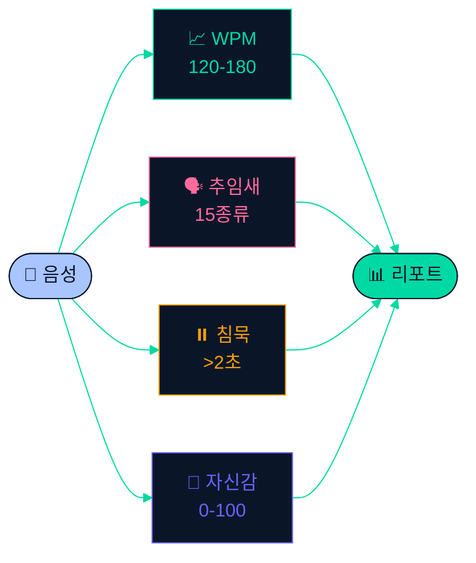

---

## 11. 기술 스택

```mermaid
%%{init: {'theme': 'base', 'themeVariables': { 'primaryColor': '#0A1628', 'primaryTextColor': '#fff', 'lineColor': '#00D9A3'}}}%%
flowchart LR
    subgraph FE["🎨 Frontend"]
        F1(["Next.js 16"])
        F2(["React 18"])
        F3(["Tailwind"])
        F4(["Capacitor"])
    end

    subgraph AI["🤖 AI/ML"]
        A1(["GPT-4o"])
        A2(["Whisper"])
        A3(["TTS-1"])
        A4(["Embeddings"])
    end

    subgraph DB["🗄️ Database"]
        D1(["PostgreSQL"])
        D2(["pgvector"])
        D3(["Supabase"])
    end

    FE --> AI --> DB

    style FE fill:#00D9A3,stroke:#00D9A3,color:#0A1628
    style AI fill:#FF6B9D,stroke:#FF6B9D,color:#fff
    style DB fill:#0A1628,stroke:#00D9A3,color:#fff
    style F1 fill:#0A1628,stroke:#00D9A3,color:#00D9A3
    style F2 fill:#0A1628,stroke:#00D9A3,color:#00D9A3
    style F3 fill:#0A1628,stroke:#00D9A3,color:#00D9A3
    style F4 fill:#0A1628,stroke:#00D9A3,color:#00D9A3
    style A1 fill:#0A1628,stroke:#FF6B9D,color:#FF6B9D
    style A2 fill:#0A1628,stroke:#FF6B9D,color:#FF6B9D
    style A3 fill:#0A1628,stroke:#FF6B9D,color:#FF6B9D
    style A4 fill:#0A1628,stroke:#FF6B9D,color:#FF6B9D
    style D1 fill:#1a2744,stroke:#A8C5FF,color:#A8C5FF
    style D2 fill:#1a2744,stroke:#A8C5FF,color:#A8C5FF
    style D3 fill:#1a2744,stroke:#A8C5FF,color:#A8C5FF
```

---

## 12. 인증 플로우

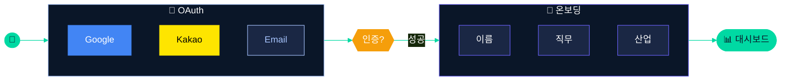

---

## 13. 데이터 흐름

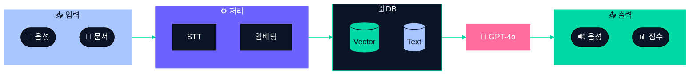

---

## 14. 시스템 프롬프트 구조

```mermaid
%%{init: {'theme': 'base', 'themeVariables': { 'primaryColor': '#0A1628', 'primaryTextColor': '#fff', 'lineColor': '#00D9A3'}}}%%
flowchart LR
    subgraph BASE["🎭 페르소나"]
        B1["역할"]
        B2["MBTI"]
        B3["이름"]
    end

    subgraph CTX["📄 컨텍스트"]
        C1["이력서"]
        C2["포트폴리오"]
        C3["JD"]
    end

    subgraph RULE["📋 규칙"]
        R1["반복금지"]
        R2["JSON출력"]
        R3["STAR평가"]
    end

    subgraph OUT["📤 출력"]
        O1["question"]
        O2["evaluation"]
        O3["follow_up"]
    end

    BASE --> CTX --> RULE --> OUT

    style BASE fill:#6C63FF,stroke:#6C63FF,color:#fff
    style CTX fill:#FF6B9D,stroke:#FF6B9D,color:#fff
    style RULE fill:#F59E0B,stroke:#F59E0B,color:#fff
    style OUT fill:#00D9A3,stroke:#00D9A3,color:#0A1628
    style B1 fill:#1a2744,stroke:#6C63FF,color:#fff
    style B2 fill:#1a2744,stroke:#6C63FF,color:#fff
    style B3 fill:#1a2744,stroke:#6C63FF,color:#fff
    style C1 fill:#1a2744,stroke:#FF6B9D,color:#fff
    style C2 fill:#1a2744,stroke:#FF6B9D,color:#fff
    style C3 fill:#1a2744,stroke:#FF6B9D,color:#fff
    style R1 fill:#1a2744,stroke:#F59E0B,color:#fff
    style R2 fill:#1a2744,stroke:#F59E0B,color:#fff
    style R3 fill:#1a2744,stroke:#F59E0B,color:#fff
    style O1 fill:#0A1628,stroke:#00D9A3,color:#00D9A3
    style O2 fill:#0A1628,stroke:#00D9A3,color:#00D9A3
    style O3 fill:#0A1628,stroke:#00D9A3,color:#00D9A3
```

---

## 15. ERD (간소화)

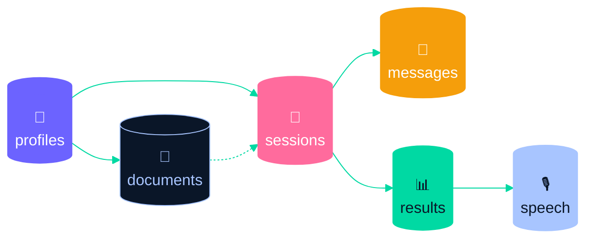

---

## 📋 사용 가이드

### Mermaid to Figma 사용법

1. 코드 블록 복사 (` ```mermaid ` 와 ` ``` ` 제외)
2. Figma 플러그인 실행 → 코드 붙여넣기 → Generate
3. 필요시 추가 스타일링

### 색상 변경

```
#00D9A3 → Mint      #0A1628 → Navy
#6C63FF → Purple    #FF6B9D → Pink
#A8C5FF → Blue      #10B981 → Green
```

---

*문서 생성일: 2025년 | IMSAM AI Interview*
